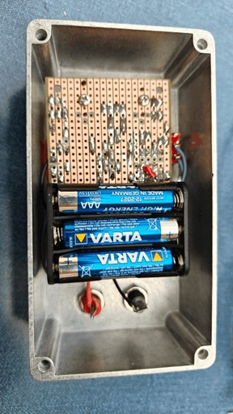

# Differential pressure probe

[](https://notbyai.fyi/)

I wanted to measure air flows and pressure differences in my home's ventilation system. Such pressure differences are small, even 1 Pa (0.1 mm water column!) matters, and that's not easy to measure. Consequently, commercially available products that are good enough are quite expensive. So *tein itse ja säästin*!

Instead of a fully standalone MCU-controlled device like this absolutely impressive https://github.com/ardiloot/dif-pressure-meter I wanted some digital detox because I do SW for a living. A **differential pressure probe** gives out a voltage proportional to the pressure difference, and can be connected to a multimeter, data logger, or oscilloscope. Apart from being easier to make, modularity is always beautiful, and an analog voltage signal is the most ubiquitous and flexible interface; "portable" in software terms.

## Implementation

All this is just some supporting circuitry around the fabulous Sensirion SDP series sensor, which detects pressure difference via temperature measurement of a gas stream through the sensor. Yes, **air flows through the sensor**. Appropriate for many applications, but not all.


The SDP816-125Pa datasheet provides a relation `dP=(190*AOut)/Vdd-38`. Rearranged to `AOut=dP*Vdd/190+Vdd/5`, it's easy to see that:
1. Sensitivity (V/Pa) depends on Vdd, known as "ratiometric" analog output.
2. Zero Pascal is not zero Volt – it can't be, because the power supply is single-sided, and we need to be able to measure negative pressures too to differentiate zero from negative, even if we knew the direction of pressure difference in advance.

So, while simply powering the SDP816-125Pa from a battery and connecting AOut to a multimeter would work, the readings wouldn't be directly useful. For nice readings, we need:
* Stable PSU
* Appropriate voltage scaling, so that, for example, 1 Pa = 10 mV
* Appropriate bias, so that 0 Pa = 0 V

Here's a simple circuit to do all that: [differentialpressureprobe.pdf](differentialpressureprobe.pdf). The chosen components are available in tangible TO/DIP packages so that it's easy to build on a stripboard with old-school tools. The SDP816-125Pa pin pitch is less than the standard 2.54 mm, but it fits on regular stripboard by bending the pins a bit. Protect the sensor ports from crap with tape while building. Before soldering, mount the sensor carefully to the board with M2.5 screws so that the pins don't bear any load.

 

Parts list is here:
```
  R1 10 k
  R2 4.7 k
  R3, R6, R7 750 R
  R4 110 k
  R5 150 k
  RV1 100 k (multiturn)
  C1, C2, C3 1 µF ceramic (X7R)
  U1 TL431CZ
  U2 MCP1700-3302E/TO
  U3 MCP6002-I/P
  U4 SDP816-125Pa
  D1 green LED
  CB1 power switch
  3xAAA battery holder, stripboard, M2.5 screws, enclosure, wires, connectors (banana socket)
```

The striboard layout you'll need to figure out on your own :)

### Power supply

For power, 3xAAA batteries + MCP1700-3302E/TO for voltage regulation are good. Since the sensor output voltage is ratiometric, dying batteries pose an insidious problem; everything might still appear to work, but the readings are wrong! To guard against that, the power LED is fed via the wonderful TL431CZ "programmable shunt regulator" chip (thanks https://electronics.stackexchange.com/a/174145). The circuit is a bit hacky, operating on the verge of TL431 specs, and it might oscillate. But it's simple, and it seems to fulfill its purpose: if the LED is lit, then the battery voltage is sufficient for our regulator to give out a good 3.3 V.


### Voltage scaling and bias

The 110+150 k voltage divider scales the SDP816-125Pa output so that 1 mV = 0.1 Pa. A 1 µF capacitor there filters out unnecessary noise above ~3 Hz, but the cap can well be smaller or larger or left out completely.


Bias is adjustable, because an accurate zero is what matters; 99 or 101 Pa, who cares, but -0.1 or +0.1 Pa is day and night. A good-quality multiturn trimmer is a must; I used a Bourns PV36X104C01B00 25-turn model. For easier (less sensitive) trimming, use a 100 k fixed resistor to 3.3 V and a 20 k trimmer to GND.


MCP6002-I/P dual op-amp is used as a unity gain buffer. Apart from operating from a single 3.3 V power supply, it is unity-gain stable and rail-to-rail input and output = minimum surprise. The 750 R isolation resistors guarantee stability with possible capacitive loads such as long cables, as recommended in the datasheet section 4.3, but they also make the output voltage dependent on load; the assumption is that the receiving instrument input is "high enough impedance" (>1 MOhm) so that the 1.5 k output impedance can be ignored.

## Performance

Connected to a decent multimeter that can measure millivolts, and bias carefully zeroed, this setup should give better than 0.1 Pa (1 mV) accuracy in the low end and 3 % span accuracy, if we trust Sensirion's specs and haven't made some coarse mistake. This outperforms most commercially available devices, such as >1000 € Fluke 922 with 1 Pascal "resolution".

The measurement range is asymmetric, expected output is -125 mV (-12.5 Pa) ... +1250 mV (+125 Pa). The negative side is there mainly to differentiate zero from negative; usually, you assume the direction of the pressure gradient in advance and connect the sensor accordingly.


Experimentally, it seems to work for measuring not only the pressure difference (and so, volumetric flow rate) across air vents (a couple of Pa to a few dozen Pa) and across the building envelope (~0 to 2 Pa), but even air flow across rooms, under door gaps (0.1 to 0.3 Pa in my home) can be clearly detected. |Voltage| stays the same and only its sign changes when swapping the tube from "high" to "low" (as long as |pressure| < 12.5 Pa). Numbers seem to make sense. I trust it!
